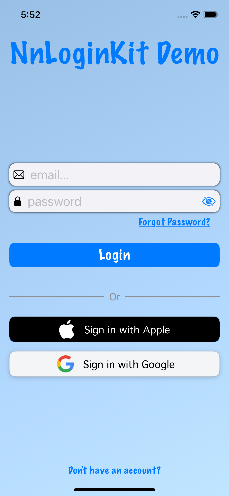
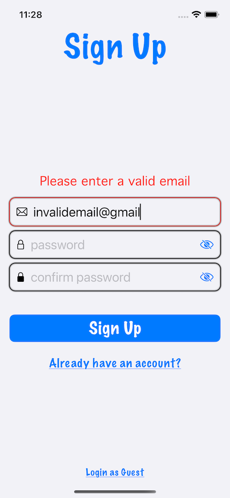
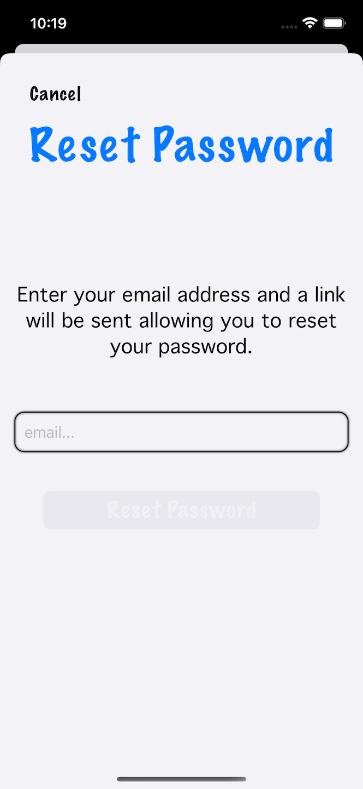

# NnLoginKit

This package provides a simple SwiftUI view to handle email login and sign-up, as well as optionally resetting passwords. The default colors are black and white, but you have the option of customizing the colors to fit your app's design. While NnLoginKit does provide basic email and password validation, it does NOT perform any authentication logic. You must pass your own authentication to the view via the global method provided.

A demo app (iOSLoginSample) is also provided in the package.

## Installation

To use NnLoginKit in your own project, add the following dependency to your Package.swift file:

```
dependencies: [
    .package(url: "https://github.com/username/MySwiftPackage", from: "1.0.0")
],
```

## Usage
NnLoginKit uses a global function to create a SwiftUI view. The only required parameter is `emailSignUp`. The remaining parameters are optional, and providing them will enable the associated features.

```
func makeLoginView(colorOptions: LoginColorOptions = LoginColorOptions(),
                   guestLogin: (() async throws -> Void)? = nil,
                   emailLogin: ((EmailLoginInfo) async throws -> Void)? = nil,
                   emailSignUp: (@escaping (EmailLoginInfo) async throws -> Void),
                   resetPassword: ((String) async throws -> Void)? = nil) -> some View
```

#### guestLogin
Providing this method will cause the `GuestLoginButton` to appear at the bottom of the view while in 'SignUp' mode (more on this in the next section).

#### emailLogin
Providing this method will cause the `AccountTypeButton` to appear beneath the `LoginButton`. Tapping it will toggle the mode between 'SignUp' and 'Login'.

While in 'SignUp' mode, three textfields are displayed (email, password, confirmPassword), as well as the `GuestLoginButton` if enabled.

In 'Login' mode, only email and password textfields are visible. Also, if you've enabled resetPassword (see below), the associated button will be displayed beneath the password textfield.

#### emailSignUp
Prior to calling this method, NnLoginKit will verify that both passwords match. Errors are displayed above the textfields as a message only AFTER the `SignUpButton` is tapped.

#### resetPassword
Providing this method will cause the `ForgotPasswordButton` to appear between the password textfield and the `LoginButton`, but only during 'Login' mode. Tapping it will modally present the `ResetPasswordView`, where users can enter the email associated with their account.

#### colorOptions
Use the `LoginColorOptions` struct to customize the display colors of the views.

```
struct LoginColorOptions {
    let title: Color              // changes the title color in LoginView and ResetPasswordView
    let detailsText: Color        // changes text color for message presented in ResetPasswordView
    let buttonText: Color         // changes text color for Login/SignUp button and ResetPasswordButton
    let buttonBackground: Color   // changes background color of Login/SignUp button and ResetPasswordButton
    let underlinedButtons: Color  // changes colors for AccountTypeButton, ForgotPasswordButton, and GuestLoginButton
    let viewBackground: Color     // changes the background color for LoginView and ResetPasswordView
    let textFieldTint: Color      // changes color of eye images in password textfields
    let errorText: Color          // changes color of error message displayed above textfields
}
```


## Images
The below images have enabled `guestLogin`, `emailLogin`, and `resetPassword` and use the following `LoginColorOptions`:

```
LoginColorOptions(title: .blue, buttonBackground: .blue, underlinedButtons: .blue, textFieldTint: .blue)
```
<div style="display: flex; justify-content: space-between;">
   
   
   
</div>


## License
This package is available under the MIT license. See the LICENSE file for more information.
