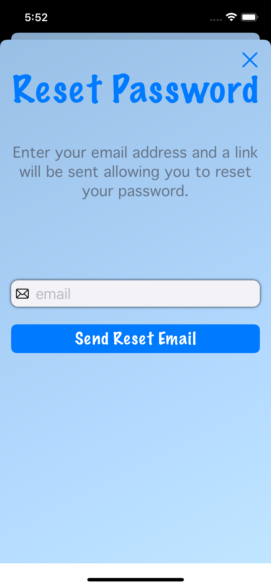

# NnLoginKit

This package provides a simple SwiftUI view to handle email login and sign-up, as well as optionally resetting passwords. It also provides both apple and google buttons to easily sign in with those methods. The default colors are black and white, but you have the option of customizing the colors to fit your app's design. While NnLoginKit does provide basic email and password validation, and while it will create tokens info for both apple and google, it does NOT perform any authentication logic. You must pass your own authentication to the view via the global method provided.

A demo app (iOSLoginSample) is also provided in the package.

## Installation

To use NnLoginKit in your own project, add the following dependency to your Package.swift file:

```
dependencies: [
    .package(url: "https://github.com/username/MySwiftPackage", from: "2.0.0")
],
```

## Usage
NnLoginKit uses a global function to create a SwiftUI view. The only required parameter is `emailSignUp`. The remaining parameters are optional, and providing them will enable the associated features.

```
func makeLoginView(appTitle: String, titleImage: Image? = nil, colorsConfig: LoginColorsConfig = LoginColorsConfig(), auth: NnLoginAuth) -> some View
```

#### appTitle
The title of your app, it will be displayed at the top. 

#### titleImage
Pass an image to have it displayed under the app's title. The image should be large enough to be displayed in 30% of the view.

#### colorsConfig
Use the `LoginColorsConfig` struct to customize the display colors of the views.

```
struct LoginColorOptions {
    let titleColor: Color                  // changes the title color in LoginView and ResetPasswordView
    let detailsColor: Color                // changes text color for message presented in ResetPasswordView
    let buttonTextColor: Color             // changes text color for Login/SignUp button and ResetPasswordButton
    let buttonBackgroundColor: Color       // changes background color of Login/SignUp button and ResetPasswordButton
    let underlinedButtonColor: Color       // changes colors for AccountTypeButton, ForgotPasswordButton, and GuestLoginButton
    let viewBackgroundColor: NnLoginColor  // see below for more details
    let textFieldTint: Color               // changes color of eye images in password textfields
    let errorTextColor: Color                   // changes color of error message displayed above textfields
}
```

##### NnLoginColor
I wanted the option to use either a Color or a LinearGradient for the viewBackground. The `view()` helper method is used to pass the correct value into the `.background()` modifier.

```
enum NnLoginColor {
    case color(Color)
    case gradient(LinearGradient)
    
    func view() -> some View {
        switch self {
        case .color(let color):
            return AnyView(color)
        case .gradient(let gradient):
            return AnyView(gradient)
        }
    }
}
```

#### auth (NnLoginAuth)
`NnLoginAuth` is the prototol used to encapuslate the authorization methods. 

```
 protocol NnLoginAuth {
    func guestSignIn() async throws
    func emailLogin(email: String, password: String) async throws
    func sendResetEmail(email: String) async throws
    func appleSignIn(tokenInfo: AppleTokenInfo) async throws
    func googleSignIn(tokenInfo: GoogleTokenInfo) async throws
}
```

##### AppleTokenInfo
A typealias containing the tokenId string and the nonce string used in the Apple Sign-In process.

##### GoogleTokenInfo
A typealias containing the tokenId string and the accessTokenId string used in the Google Sign-In process.

## Images

<div style="display: flex; justify-content: space-between;">
   
   
   
</div>


## License
This package is available under the MIT license. See the LICENSE file for more information.
