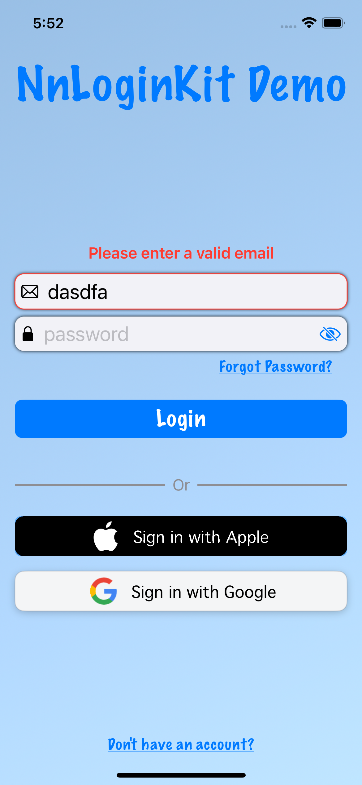

# NnLoginKit

NnLoginKit is a Swift package designed to simplify the process of integrating user authentication and account linking into iOS applications. It provides a quick way to implement login screens with customizable text and color configurations, and it supports different authentication methods such as email/password, Apple, and Google. Moreover, it also provides manual authentication, helping to handle user reauthentication in sensitive actions like account deletion.

The package is built to work with FirebaseAuth, offering a streamlined, SwiftUI-friendly approach for adding secure user authentication features in your apps.

A demo app (iOSLoginSample) is also provided in the package.

## Features

- **Simple Login Setup:** Easily create a login page with the provided `makeLoginView` function. Just pass your authentication handler that conforms to `NnLoginAuth`, along with the desired text and color configurations.
- **Variety of Authentication Methods:** The package supports various authentication methods, including email/password, Google, and Apple.
- **Customizable UI:** With `NnLoginColorsConfig` and `NnLoginTextConfig`, you can customize the appearance and content of your login page to fit your app's theme and language.
- **Account Linking:** The `makeAccountLinkView` function provides a simple way to handle account linking, enabling users to link various provider accounts together for seamless sign-in.
- **Manual Authentication:** NnLoginKit provides a handler for manual authentication, facilitating user reauthentication for sensitive operations.
- **Error Handling:** Errors that conform to `NnDisplayableLoginError` can easily be displayed to the user in a user-friendly way.


## Usage
To create a login view:

```
let loginView = NnLoginit.makeLoginView(
    titleImage: UIImage(named: "appLogo"),
    textConfig: NnLoginTextConfig(appTitle: "MyApp", tagline: "Doing Things Right!", subTagline: "Let's Get Started."),
    colorsConfig: NnLoginColorsConfig(),
    auth: myAuthHandler // Should conform to `NnLoginAuth`
)

``` 

To create an account link view:

```
let accountLinkView = makeAccountLinkView(
    sectionTitle: "Sign-in Methods",
    linkButtonTint: .blue,
    auth: myAccountLinkAuthHandler, // Should conform to `NnAccountLinkAuth`
    isLoading: .constant(false),
    setAuthenticationStatus: { isAuthenticated in 
        // Handle authentication status change
    }
)

```

## Installation

To use NnLoginKit in your own project, add the following dependency to your Package.swift file:

```
dependencies: [
    .package(url: "https://github.com/nikolainobadi/NnLoginKit", from: "2.0.0")
],
```

<!--## Images-->
<!---->
<!--<div style="display: flex; justify-content: space-between;">-->
<!--   -->
<!--   -->
<!--   -->
<!--</div>-->


## License
This package is available under the MIT license. See the LICENSE file for more information.
